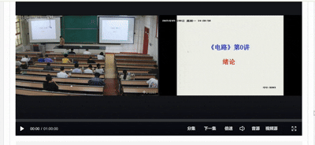

# XJTU-class-record-episode-fix
> xjtu录像平台真的设计的像依托屎，录像上传慢、经常缺损就算了（一次维护之后22年之前的录像都看不了了），整个平台维护这么久了从来不支持下一集和分集选择，再加上页面是angularJS动态生成的，根本无法用中键或者右键打开某一页，我也真的是忍受这个很久了，现在ai代码生成足够厉害了，我和ai一起分析了iframe结构，成功在内嵌播放器里嵌入生成了这个功能，我之前还做了拆开angularJS动态生成的课程分集来把url暴露在外的插件，不过现在有这个插件也不需要了，终于真的可以一集集打开了，可惜我也快毕业了。

## 功能支持
- **注入分集功能** 可以在某一集课程录像中任意选择某一天的某一集
- **注入下一集功能** 看完某一集录像终于不用跳回去打开下一集了，可以直接跳转
## 功能演示

## 使用
### 第一步：安装脚本管理器
本脚本需要配合浏览器扩展 **Tampermonkey (油猴)** 使用。如果你尚未安装，请根据你的浏览器点击下方链接安装：

- [Chrome / Edge 版本](https://chrome.google.com/webstore/detail/tampermonkey/dhdgffkkebhmkfjojejmpbldmpobfkfo)
- [Firefox 版本](https://addons.mozilla.org/zh-CN/firefox/addon/tampermonkey/)
- [Safari 版本 (Userscripts)](https://apps.apple.com/app/userscripts/id1463298887)

### 第二步：安装脚本
确保第一步完成后，点击下方的安装链接即可：

**[点击此处安装 XJTU课程录像分集功能修复](https://greasyfork.org/zh-CN/scripts/558424-xjtu%E8%AF%BE%E7%A8%8B%E5%BD%95%E5%83%8F%E5%88%86%E9%9B%86%E5%8A%9F%E8%83%BD%E4%BF%AE%E5%A4%8D)**

> **提示**：点击后会跳转到 Tampermonkey 的安装页面，点击页面上的 **“安装”** 或 **“Install”** 按钮即可。

---

### 使用说明
1. 脚本安装完成后，打开 **xjtu课程录像平台**。
2. 等待页面加载，你会发现在原本的内嵌播放器里出现了两个按钮。
3. 点击分集可以在列表里查看和跳转全部课时分集。
4. 点击“下一集”可跳转至下一个课时。

